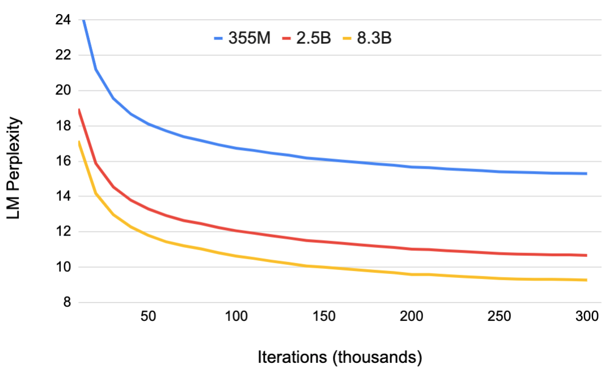

# Migatron-LM:多参数语言模型并行化的训练

## 摘要
无监督语言建模方面的最新工作表明，训练大型神经语言模型可以促进自然语言处理应用程序的最新发展。 但是，对于非常大的模型，内存约束限制了可以实际训练的模型的大小。 
模型并行性允许我们训练更大的模型，因为参数可以在多个处理器之间分配。 在这项工作中，我们实现了一种简单，高效的层内模型并行方法，该方法可以训练具有数十亿个参数的
最新转换器语言模型。 我们的方法不需要新的编译器或库更改，它与管道模型并行性正交且互为补充，并且可以通过在本地PyTorch中插入一些通信操作来完全实现。 
我们通过使用512个GPU融合83亿个参数变压器语言模型来说明这种方法，使其成为有史以来最大的变压器模型，其模型是BERT大小的24倍和GPT-2大小的5.6倍。 
与强大的单处理器基准每秒可维持39TeraFLOP每秒（占峰值FLOP的30％）相比，我们在整个应用程序中每秒可维持高达15.1 PetaFLOP每秒的扩展效率。 
该模型使用174GB的文本进行训练，需要9.2天的12ZettaFLOP才能收敛。 转移此语言模型可在WikiText103（SOTA复杂度为16.4的10.8）和LAMBADA（SOTA准确度为63.2％的66.5％）
上获得最先进的（SOTA）结果。 我们发布培训和评估代码以及较小的便携式模型的权重，以实现可重复性.

## 1 简介
自然语言处理（NLP）的发展很快，部分原因是可用计算和数据集大小的增加。 大量的计算和数据可以通过无监督语言模型预训练来训练越来越大的
语言模型（Devlin等人，2018; Radfordet等人，2019b）。 经验证据表明，较大的语言模型对于NLP任务（如文章完成，问题回答和自然语言推断）非常有用。 
通过在下游自然语言任务上转移或微调这些经过预训练的语言模型，可以实现最新成果（Devlin等人，2018; Peters等人，2018; Howard＆Ruder，2018; Radford等人，2018; 2019b; 2017; Ramachan-dran等人，2016; Liu等人，2019b; Dai等人，2019; Yanget等人，2019; Liu等人，2019a）。 

模型变得更大，它们超出了现代处理器的内存限制，并需要其他内存管理技术，例如激活检查点（Chen et al。，2016）。
广泛使用的优化算法（例如ADAM）需要每个参数额外的内存来存储动量和其他优化器状态，​​从而减小了可以有效训练的模型的大小。 通过对模型进行分区，
使得权重及其关联的优化器状态不需要并发地驻留在处理器上，几种并行建模的方法克服了这一限制。 例如，GPipe（Huang等人，2018）和Mesh-Tensorflow（Shazeer等人，2018）
为不同类型的模型并行性提供了框架。 但是，他们需要重写模型，并依赖仍在开发中并且不适用于所有问题的定制编译器和框架。

在这项工作中，我们使用层内模型并行性有效地训练了基于转换器的语言模型，该模型具有83亿个参数。 我们利用基于变压器的语言模型的固有结构，来构建简单的模型并行实现，
从而在PyTorch中进行有效的训练，而无需自定义C ++代码或编译器。 这种方法与诸如（Huang et al。，2018）之类的方法所倡导的基于管道的模型并行性正交。

  
*图1.模型（蓝色）和模型+数据（绿色）并行FLOP具有GPU数量的函数。 模型并行（蓝色）：多达8路模型并行弱缩放，每个GPU约有10亿个参数（例如2个GPU为20亿个参数，
4个GPU为40亿个）。 模型+数据并行（绿色）：与模型并行与64路数据并行组合的相似配置*

为了演示我们方法的可扩展性，我们通过训练12亿个参数的模型来建立基准在单个NVIDIA V100 32GB GPU上，在整个培训应用过程中，每秒可支持39TeraFLOP。 
这是DGX-2H服务器中配置的单个GPU的理论峰值FLOPS的30％，因此代表了非常强的基准。 通过8路模型并行度，在512个GPU上将模型扩展到83亿个参数，
在整个应用程序中，我们每秒可实现高达15.1 PetaFLOP。 与单GPU情况相比，这是76％的缩放效率。 在9.2天内将模型融合到174 GB的文本上，总共需要12个ZettaFLOP。 
图1显示了更详细的缩放结果。我们通过计算WikiText103数据集上的困惑度和LAMBADA数据集上的克洛什风格预测准确性来分析训练模型的准确性。 

我们显示，随着模型大小的增加，WikiText103的困惑度降低，LAMBADA的准确性提高，并且在这些任务上实现了最新的技术成果。

总而言之，我们的贡献如下：
- 我们仅对现有的PyTorch变压器实现方案进行了一些有针对性的修改，从而实现了一种简单而有效的模型并行方法。  
- 我们演示了基于参数转换器的83亿语言模型的融合.  
- 我们展示了我们的模型通过在WikiText103（10.8ppl）上实现SOTA困惑和在LAMBADA数据集上实现SOTA准确性（66.5％），进一步证明了我们的模型进一步提高了自然语言处理的最新水平（SOTA)
- 我们对我们的模型和数据并行技术进行了深入的经验分析，并使用512个GPU演示了高达76％的缩放效率。  
- 我们在以下位置开放了我们的代码以及训练和评估管道的代码 

## 2 背景与挑战
### 2.1神经语言模型的预训练
预训练的语言模型已成为NLP研究人员工具包中不可或缺的一部分。 利用大型语料库预训练来学习语言的鲁棒性神经表示形式是过去十年来研究的一个活跃领域。 
在此期间，社区已经看到这些预培训方法的规模和复杂性呈不断增长的趋势，这些方法稳步推进了最新技术。 预先训练和传递语言的神经表示的早期例子表明，
与从头开始学习的词嵌入表相比，预训练词嵌入表可改善下游任务结果（Mikolov等，2013； Pennington等，2014； Turian等，2010）。 后来，
通过学习和转移捕获单词的上下文表示的神经模型，在该领域进行了进一步的研究（Melamud等人，2016; McCannet等人，2017; Peters等人，2018; Radford等人，2017; 2019b） 
最近的平行工作（Ramachandran等，2016; Howard＆Ruder，2018; Radford等，2018; Devlin等，2018; Liu等，2019b; Dai等，2019; Yang等， 2019; Liuet al。，2019a）
进一步建立了这些想法，不仅是通过转移语言模型来提取上下文单词表示形式，而且还通过以端到端的方式对下游任务进行语言模型的微调。 

通过这些工作，现有技术已从仅传输单词嵌入表发展到传输整个1.5B参数语言模型。 随着方法的发展，对硬件，系统技术和框架的需求，
使它们能够大规模有效地运行并满足不断增长的计算需求。我们的工作旨在提供必要的工具，以在这一趋势中迈出新的一步.

### 2.2变压器语言模型和Multi-HeadAttention
语言建模是自然语言处理和语言理解的核心任务。 它被广泛地用于许多应用中，例如语音识别，问答和摘要。 为了建模语言的先后顺序，
使用了递归神经网络（RNN / L-STM（Hochreiter＆Schmidhuber，1997））已有十多年了。 但是，由于它们无法建模远程依赖项以及这些模型（一个接一个地处理令牌），
在大型语料库上进行有效的培训一直是一个挑战。 最近，已经引入了基于注意力模块的新方法，称为变压器（Vaswani et al。，2017）。 
这些模型展示了出众的准确性和计算效率。转换器无需一一考虑令牌并保持隐藏状态，而是可以考虑令牌的整个段并学习如何解释其中的依赖性.

  
*图2 GPT-2变压器架构 紫色块对应于完全连接的层。 每个蓝色块代表单个变压器层，该层被复制N次。*

原始的转换器公式被设计为一种机器翻译架构，该架构使用两个部分（编码器和解码器）将输入序列转换为另一个输出序列。 
但是，最近利用变压器进行语言建模的工作如GPT（Radfordet等人，2018），BERT（Devlin等人，2018）和GPT-2（Radfordet等人，2019b）
仅根据其需求使用EncoderorDecoder。 GPT，GPT-2和其他自回归变压器语言模型（Dai等人，2019; Yang等人，2019）采用了多层变压器解码器架构。 
我们的工作重点是类似于GPT-2的体系结构。 下面介绍了GPT-2变压器模型的高级概述.

图2显示了我们使用的模型的示意图，该模型包括一个输入子词令牌嵌入层，位置嵌入层，变压器层，线性输出嵌入层，最后是最后的softmax层。 
嵌入层将输入的子词标记嵌入向量中，而位置编码则有助于转换器捕获输入标记的顺序。位置编码被添加到子词嵌入层的输出中，并馈送到第一个转换器层。 
最后一个变压器层被赋予线性层，其权重等于输入嵌入的转置。 为了生成输出子词标记的概率分布，应用最终的softmax层.

如上所述，每个转换器层是一个仅用于解码器的转换器块，它由一个带有左右注意掩码的多头注意层和一个前馈层组成。 每个多头注意层由并行运行的几个注意头组成。 
每个关注头使用自我关注来自适应地处理以其他输入令牌为条件的每个令牌输入。 左至右注意掩码可确保给定输入仅位于其左前方的位置。 
每个头使用一个完全连接的层将每个令牌映射到维度，隐藏大小/关注头数的键，查询和值向量，然后每个关注头将所有键值对上的查询映射到其输出。 
对于序列中的单个查询，这被实现为查询与所有其他键的缩放点积，然后是softmax，然后将softmax用于获得所有值的加权和。 为了提高模型的鲁棒性并帮助训练收敛性，
将注意力缺失应用于softmax值。 对于单个令牌，多个关注头的输出被连接到一个向量中，该向量是隐藏维的大小。 可以在（Vaswaniet al。，2017）
中找到有关变压器层的更多详细信息。

值得一提的是，GPT-2在多头注意力和前馈层的输入中使用了GeLU（Hendrycks＆Gimpel，2016）非线性和层归一化（Ba et al。，2016）。 
前者（Vaswani et al。，2017）使用ReLU非线性并将层归一化应用于输出。 因此，在GPT-2模型中，在最终的转换器层之后添加了附加的层归一化。

### 2.3深度学习中的数据和模型并行性
有两个主要的范例可以将深度神经网络训练扩展到众多硬件加速器：数据并行性（Valiant，1990），其中训练微型batchi分布在多个工作人员上，以及模型并行性，
其中内存使用情况和 模型的计算分布在多个工作人员之间。 数据并行性由于其理想的弱缩放特性而已成为大规模深度神经网络训练必不可少的工具。
通过与可用工人数量成比例地增加最小批量大小，人们可以观察到接近线性缩放训练数据吞吐量。 但是，大批量训练会在优化过程中引入复杂性，
这可能会导致准确性降低或收敛时间更长，从而抵消了增加训练吞吐量的好处（Keskar等人，2017）。 进一步的研究（Goyal等人，2017; You等人，2017; 2019）
已开发出减轻这些影响的技术，并将大型神经网络的训练时间从数周和数月缩短到数天，数小时，数分钟和数天。 在某些情况下甚至几秒钟。 
为了进一步扩大训练范围，并行工作（Chen et al。，2016）将数据并行性与激活检查点相结合：在后向传递中重新计算激活而不将它们存储在前向传递中以减少内存需求.

但是，这些技术在可解决的问题规模上有一个基本限制：模型必须完全适合一名工人。 随着像BERT和GPT-2这样规模和复杂性不断增加的语言模型，
神经网络已经接近现代硬件加速器的存储容量。 为了继续发展该领域并训练可与计算资源很好地匹配的更大的语言模型，我们必须在数据并行性之外再利用模型并行性。 
在模型并行性中，还有另外两个范式：逐层管道并行性和更通用的分布式张量计算。 在管道模型并行化中，在将输出传递到执行另一组操作的管道中的下一个设备之前，
对一个设备执行一组操作。 为确保设备不处于空闲状态，等待其他设备的输入，流水线并行处理（并通常增加）批大小，以便始终在设备上计算小批量的一部分，
并最大限度地利用所有设备 在任何时候，这种模型并行性方法都反映了CPU中的指令流水线。 一些方法（Harlap等，2018; Chen等，2018）结合管道并行性使用
参数服务器（Li等，2014）。 但是，它们存在不一致的问题。 TensorFlow的GPipe框架（Huang et al。，2018）通过使用同步梯度体面技术克服了这种不一致的问题，
这种方法需要额外的逻辑来处理这些通信和计算操作的高效流水线操作，并且会遭受降低效率的管道气泡的困扰， 或对优化程序本身的更改会影响准确性.

分布式张量计算是一种更通用的方法，可在多个设备之间划分张量操作以加速计算或增加模型大小。 FlexFlow（Jia等人，2018）是协调此类并行计算的深度学习框架，
它提供了一种选择最佳并行化策略的方法。 最近，Mesh-TensorFlow（Shazeer等人，2018）引入了一种语言，用于指定Ten-sorFlow中的分布式张量计算的通用类（Abadi等人，2015）。 
平行尺寸为由最终用户使用该语言指定，并且结果图使用适当的集合基元进行编译。 我们利用与Mesh-TensorFlow中所利用的相似的见解，并在计算变压器的注意头以并行化我们的变压器模型时利用并行性。 
但是，我们没有为模型并行性实现框架和编译器，而是仅对现有的PyTorch转换器实现进行了一些针对性的修改。 我们的方法很简单，不需要任何新的编译器或代码重新布线，
并且可以通过插入一些简单的原语来完全实现，如下一节所述。

## 3 模型并行变压器
我们利用变压器网络的结构，通过添加少量同步原语来创建简单的模型并行实现。 转换层由一个自我注意模块和一个两层，多层感知器（MLP）组成，如图2所示。
我们分别在这两个模块中引入模型并行性。我们首先详细介绍MLP模块。 该块的第一部分是GEMM，其后是GeLU非线性:  
 \begin{equation}
    Y = \textrm{GeLU}(XA)
 \end{equation}
 
 并行化GEMM的一种方法是沿行将权重矩阵$A$拆分，并沿其列输入$X$，如下所示:
 \begin{equation}
    A=\begin{bmatrix}
        A_1 \\
        A_2
    \end{bmatrix}, 
     X = [X_1, X_2].
 \end{equation}
此分区将导致$Y = \textrm {GeLU}（X_1A_1 + X_2A_2$。 由于GeLU是非线性函数，因此$\textrm {GeLU}（X_1A_1 + X_2A_2）\neq \textrm {GeLU}（X_1A_1）+ \textrm {GeLU}（X_2A_2$和此方法在GeLU函数之前需要一个同步点 。
 
另一种选择是沿其列$A = [A_1，A_2]$拆分$A$。 这种划分允许将GeLU非线性独立地应用于每个已划分的GEMM的输出:
 \begin{equation}
    [Y_1, Y_2]= [\textrm{GeLU}(XA_1), \textrm{GeLU}(XA_2)] 
 \end{equation}
    
    
这是有利的，因为它删除了同步点。因此，我们以这种列并行的方式分割第一个GEMM，并沿其行分割第二个GEMM，以便它直接获取GeLU层的输出，而不需要任何通信，如图1所示。然后，在将输出传递到漏失层之前，第二个GEMM的输出在整个gpu上减小。这种方法将MLP块中的gemm和gpu分开，只需要在正向通行证中进行一次all reduce操作（$g$操作）和在反向通行证中进行一次all reduce操作（$f$操作）。这两个操作符是相互共轭的，可以用PyTorch实现，只需几行代码。例如，$f$运算符的实现如下：
    
  
*(a)MLP*

  
*(b)Self-Attention*
    
具有模型并行性的变压器块。 $f$和$g$是共轭的。 $f$是前向通行证中的身份运算符，所有值都在后向通行证中减少，而$g$是前向通行证和在后向通行证中的身份的全部减少。
 
```python
class f(torch.autograd.Function):
    def forward(ctx, x):
        return x
    def backward(ctx, gradient):
        all_reduce(gradient)
        return gradient
```

如图所示，对于自注意块，我们在多头注意操作中利用固有的并行性，对与键（$K$），查询（$Q$）相关联的GEMM进行分区 和（$V$）的值以列并行的方式进行，以便在一个GPU上本地完成与每个关注头对应的矩阵乘法。 这样一来，我们就可以在GPU上分配每个关注头参数和工作负载，而无需任何即时通信即可完成自我关注。 来自输出线性层的后续GEMM（经过自我关注）沿其行进行并行处理，并直接获取并行关注层的输出，而无需GPU之间进行通信。 MLP和自我关注层的这种方法将两个GEMM的组融合在一起，消除了两者之间的同步点，并实现了更好的缩放比例。 这使我们能够在简单的转换器层中执行所有GEMM，而仅使用正向路径中的两个全减少和反向路径中的两个全减少（请参见图）。
    
  
*变压器层中的通信操作。 单个模型并行变压器层的正向和反向传递中总共有4种通信操作。*


转换器语言模型的输出嵌入量是隐藏大小（$H$）乘以词汇大小（$v$）。 因为对于现代语言模型，词汇量大约为数万个令牌（例如，GPT-2使用的词汇量为50257），所以并行化输出嵌入的GEMM是有益的。 但是，在转换器语言模型中，输出嵌入层与输入嵌入共享权重，需要对两者进行修改。 我们沿词汇维度$E = [E_1，E_2]$（按列）并行化输入嵌入权重矩阵$E_ {H \ times v}$。 由于每个分区现在仅包含嵌入表的一部分，因此在输入嵌入后需要全缩减（$g$运算符）。 对于输出嵌入，一种方法是执行并行GEMM $[Y_1，Y_2] = [XE_1，XE_2]$以获得logit，然后添加全聚集$Y = \textrm {all-gather}（[Y_1， Y_2]$，并将结果发送到交叉熵损失函数。 但是，在这种情况下，全集将传达$b \times s \times v$元素（$b$是批处理大小，$s$是序列长度），这是由于词汇量很大而导致的。 为了减小通信量，我们将并行GEMM $[Y_1，Y_2]$的输出与交叉熵损失融合在一起，交叉熵损失将维数减小为$b \ s s$。 用标量损失而不是logits进行通信可以极大地减少通信量，从而提高模型并行方法的效率。

我们的大多数模型并行方法都可以描述为旨在减少通信并保持GPU计算约束的技术。

我们选择让GPU重复计算，而不是让一个GPU计算掉线，层规范化或剩余连接的一部分并将结果广播给其他GPU。 具体来说，我们在每个GPU上维护层归一化参数的副本，并获取模型并行区域的输出，并在将这些张量作为下一个模型并行区域的输入输入之前在这些张量上运行差错和残差连接。 为了优化模型，我们允许每个模型并行工作者优化其自己的参数集。 由于所有值都是GPU本地的或在GPU上重复的，因此无需在此公式中传递更新的参数值。

总之，如上所述，我们的方法很容易实现，只需要向前进和后退通道添加一些额外的全归约运算即可。 它不需要编译器，并且与\cite{GPipe}之类的方法提倡的管道模型并行性正交且互补。 在本节的其余部分，我们将描述该方法的一些实现细节。


### 3.1 模型并行随机数生成

利用随机数生成的技术（例如dropout \citep {dropout}）是现代深度学习培训的主要内容。 变压器在残差连接之前的模型并行区域之外和自注意块中的模型并行区域内具有丢失层。 由于某些辍学层在模型并行区域中，而其他不在，因此我们需要认真对待随机数生成，以确保辍学正常工作。 为了使模型并行工作人员之间的剩余连接丢失同步，我们在训练开始时用相同的种子为随机数生成器播种。 这将导致所有模型并行工作器具有相同的退出模式。 但是，模型并行区域内的丢失会导致每个工作人员具有不同的随机模式，以在整个操作中实现随机性。 为此，我们为模型并行区域内的辍学维护了一个单独的随机数生成器。 对于每个模型并行工作者，该随机数生成器都是唯一的种子。

### 3.2 混合模型和数据并行性

模型并行性与数据并行性正交，因此我们可以同时使用两者来在合理的时间内训练大型模型。 图\ ref {fig：hybrid-mpdp}显示了用于混合模型和数据并行性的一组GPU。 同一服务器内的两个或多个GPU组成模型并行组（例如，图\ ref {fig：hybrid-mpdp}中的GPU 1至8），并包含分布在这些GPU上的模型的一个实例。 其余的GPU（可能位于同一服务器中，但通常位于其他服务器中）则运行其他模型并行组。 每个模型并行组中具有相同位置的GPU（例如，图\ ref {fig：hybrid-mpdp}中的GPU 1、9，...，505）形成数据并行组，因此数据并行组中的所有GPU 拥有相同的模型参数。 在反向传播期间，我们并行运行多个梯度全减少操作，以减少每个不同数据并行组内的权重梯度。 所需GPU的总数是模型和数据并行组的数目的乘积。 例如，对于83亿个参数模型，我们每个模型并行组使用8个GPU和64路数据并行性，总共512个GPU。 所有通信都是通过对NCCL的Python调用在PyTorch中实现的。 每个模型并行组内的GPU在组内所有GPU之间执行所有归约。 对于数据并行性，每个全归约操作都是使用每个模型并行组中的一个GPU进行的。

  
*将GPU分组以实现混合模型和数据并行性以及8路模型并行和64路数据并行。*

## 4 语言模型设置

语言建模是自然语言处理和语言理解的核心任务。

语言建模有几种形式，但我们集中在最常用的形式上：对于序列$X = \{x_1，\cdots，x_m\}$，根据先前的标记，预测下一个标记$x_t$。 利用交叉熵损失，我们将

$$-\sum_i log P_\theta（x_i | x_{i-c}，\cdots，x_ {i-1}$$

其中$c$是使用的上下文，$P_\theta $是下一个标记的条件概率。

### 4.1 训练语言模型

#### 4.1.1 训练优化和超参数

为了训练我们的模型，我们遵循一个程序，该程序主要基于\cite {Radford2018GPT，Radford2019GPT2，SparseTransformers}中描述的训练程序，并添加了一些附加内容。 所有训练均以1024个子词单元的序列执行，批处理大小为512，每次迭代300k。 为了有效地训练模型，我们使用混合精度训练和动态损失缩放功能来利用V100的Tensor Cores \citep {MPTraining，AutoLossScale}。 我们首先使用简单的正态分布$W \sim\ mathcal {N}（0，0.02$初始化权重$W$。 然后，我们将紧接剩余层之前的权重按$\frac {1} {\sqrt {2N}}$缩放，其中N是由自我关注和MLP块组成的转换器层数。 对于我们的优化器，我们使用权重衰减为\ citep {loshchilov2018decoupled} $\lambda = 0.01$的Adam优化器\citep {Adam}。

此外，我们使用1.0的全局梯度范数裁剪来提高训练大型模型的稳定性。

我们的学习率为1.5e-4，在剩余的297k迭代中遵循单周期余弦衰减之前，利用了3000次迭代的预热时间。 我们以1e-5的最小学习率停止衰减。 在我们的实验中，我们发现通过交叉验证来调整特定模型的学习率可以提高准确性，但是为了简单起见，我们考虑所有模型大小的一种学习率。 在所有情况下，都使用0.1的下降值。

最后，为了更好地管理我们的内存占用，我们在每个转换器层之后使用激活检查点\citep {activation_checkpointing}。

#### 训练数据集
为了收集具有长期依赖性的大型多样的训练集，我们汇总了一些最大的语言建模数据集。 我们创建一个聚合数据集，该数据集由Wikipedia \ citep {devlin2018bert}，CC-Stories \ citep {ccstories}，RealNews \ citep {grover}和OpenWebtext组成。 为了避免训练集泄漏到我们的下游任务中，我们删除了WikiText103测试集中\ citep {wikitext}中存在的Wikipedia文章。 我们还从预处理工件引入的CC-Stories语料库中删除了不必要的换行符。

对于{\it OpenWebText}，我们创建了从{\it Reddit}（社交网络

媒体平台，用于培训。 该数据集在概念上类似于\ cite {Radford2019GPT2}中使用的网络文本数据集。 我们使用公开的OpenWebText代码库\脚注{\label {fn：openwebtext} https://github.com/eukaryote31/openwebtext}抓取了该数据集。 我们首先从Reddit抓取了所有得分不低于3业力分数的外发URL。 然后，我们过滤出包含黑名单域（例如成人内容或图像和视频托管网站），黑名单类型（例如jpg，exe，ppt等）和重复URL的URL。 我们使用{\ it报纸}库从每个URL下载文本，然后应用{\ it langdetect} \ footnote {https://pypi.org/project/langdetect/}过滤掉非英语内容，{\it ftfy} \脚注{https://ftfy.readthedocs.io/en/latest/}以规范化unicode文本。

我们组合了所有数据集，然后从聚合数据集中过滤出内容长度小于128个令牌的所有文档。 由于相似的内容可能在聚合的数据集中出现多次，因此我们使用LSH对重复的jaccard相似度大于0.7的内容进行重复数据删除。

生成的聚合语料库包含174 GB的重复数据删除文本。

为确保我们不对测试集中发现的任何数据进行训练，我们按照先前工作〜\cite {Radford2019GPT2}的方法计算也会出现在我们的训练集中的测试集8克的百分比。 为了计算重叠，我们还使用布隆过滤器，但保守的误报率为$10 ^ {-3}$，以节省计算成本。 WikiText103测试集最多重叠$10.8 \％$，而LAMBADA测试集\ citep {lambada}最多重叠$1.4 \$。 我们应该注意，WikiText103测试集与WikiText103训练集\cite {Radford2019GPT2}已经有$9.09 \％$的重叠。 由于这些与以前的工作一致，

我们有信心，我们的培训数据中不会无意中包含测试数据中的任何文件。

#### 载入数据
对于训练，我们应用字节对编码标记化\ citep {subword，Radford2019GPT2}并将此数据集随机分成29：1的比例，分别获得训练（168.2 GB）和验证（5.8 GB）的集合。 我们将训练集划分为5个相等的碎片，并随机排列这些碎片的处理顺序。 在每个分片中，我们调整文档的顺序，并在每个文档的末尾添加一个{\ it end of text}令牌。 然后，我们将整个分片展平，并将其分块为1024个令牌部分。 然后，我们最后一次随机洗牌这些块，然后将它们呈现给模型。 我们在每个时代重复这个随机过程。

### 评估语言模型
为了分析增加模型大小对模型理解语言的能力的影响，我们需要合适的评估标准。 两种常用的标准是WikiText103数据集\ citep {wikitext}上的语言模型困惑和LAMBADA数据集\ citep {lambada}上的克洛什风格预测准确性。

#### Wikitext103困惑

WikiText103困惑度是一种评估标准，自创建基准数据集以来在过去的几年中进行了深入研究。 困惑是语料库\ citep {困惑}的平均交叉熵的幂。 这使其成为语言模型的自然评估指标，该语言模型表示整个句子或文本的概率分布。  
 \begin{equation}
 PPL= \exp({-\frac{1}{T_o}\sum_{t}^{T} \text{log} P(t|0:t-1))}
 \end{equation}

为了计算（\ref {ppl_eqn}）中的困惑，我们根据子词词汇对WikiText103测试语料进行令牌化，并对每个令牌$[0，T]$的交叉熵损失求和。 然后，我们通过原始令牌化方案$T_o$中的令牌数对交叉熵损失进行归一化。 WikiText103测试语料库已经预先添加了词级标记，这些标记以前的作品曾用于计算困惑度。 为了评估模型在先前工作的公平竞争环境中的困惑，我们必须通过原始令牌数量$T_o$进行标准化，而不是根据作为模型输入输入的令牌化数据中的令牌数量$T$进行规范化 。 这种预加标记还会在文本中引入训练数据中不存在的伪像。 为了减轻这种分布不匹配，我们首先使用可逆的解令牌器对WikiText103测试数据集进行预处理，以删除与标点和空白有关的各种伪像。 $T_o$的值在此预处理之前计算。 对于WikiText103的测试集$T_o = 245566$和$T = 270329$。

我们还必须对困惑度计算做进一步的变压器特定修改。 与基于RNN的语言模型不同，转换器以固定的窗口输入大小运行。 因此，他们不能完全计算$P（t | 0：t-1$，而只能计算$P（t | t-w：t-1$，其中$w$是上下文的大小：1024个令牌。 但是，为数据集中的每个令牌计算此值的费用过高，因为我们必须计算大小为$w$的上下文的大约$T$评估。 为了有效地评估我们的模型，我们采用了一种称为\textit {overlapping Evaluation}的中间方法，在该方法中，每次使滑动窗口重叠一些$o$，并且仅计算与该窗口的最后$o$令牌相对应的交叉熵损失 。 在我们的实验中，我们使用32的重叠度$o，并以此方式计算所有滑动窗口的损耗。

#### LAMBADA封堵精度
处理长期上下文的能力对于最新的语言模型至关重要，并且是诸如长格式生成和生成等问题的必要先决条件。

基于文档的问题解答。 诸如LAMBADA之类的Cloze样式数据集旨在衡量模型在这些类型的长期上下文中进行操作并进行推理的能力。 完形填空式阅读理解使用单词标记$x = x_ {1：t}$的上下文，其中一个标记$x_j$被屏蔽； 模型的目的是正确预测丢失的$j ^ {\ text {th}}$令牌的值。 为了准确地预测丢失的令牌，该模型需要对周围环境以及在这种环境中应如何使用语言的深入了解。 LAMBADA通过构建4-5个句子的示例来掩盖上下文中的最后一个单词$x_t$，从而使用克洛什式阅读理解来测试生成的从左到右的语言模型。 我们的模型使用子词单位，因此对于LAMBADA评估，我们使用未经处理的原始LAMBADA数据集，并要求我们的模型预测组成该词令牌的多个子词令牌。 我们使用教师强迫，并且仅在所有输出预测正确时才认为答案正确。 这种表述等同于单词令牌预测的原始任务。

## 5 实验
我们所有的实验都是在NVIDIA的DGX SuperPod \脚注上进行的{请参阅https://devblogs.nvidia.com/dgx-superpod-world-record-supercomputing-enterprise/}，并且我们最多使用32台DGX-2H服务器（总共 512个Tesla V100 SXM3 32GB GPU）。 该系统针对多节点深度学习应用进行了优化，通过NVSwitch在服务器内部GPU之间的带宽为300 GB /秒，在服务器之间使用8个InfiniBand适配器的服务器之间的互连带宽为100 GB /秒。

### 标度分析
为了测试我们实现的可扩展性，我们考虑了GPT-2模型，该模型具有表\ ref {tab：params_scaling_studies}中详细介绍的四组参数。 为了在自我关注层中具有一致的GEMM大小，每个关注头的隐藏大小将保持恒定在96，同时改变头和层的数量以获取10亿到80亿个参数的配置。 具有12亿个参数的配置适合单个GPU，而80亿个参数模型则需要8路模型并行性（8个GPU）。 原始词汇量为50257，但是，对于logit层而言，要有高效的GEMM，每个GPU词汇量应为128的倍数是有利的。由于我们研究了多达8种模型并行性，因此我们填充词汇量 这样它就可以被$128 \ times 8 = 1024$整除，导致填充后的词汇量为51,200。 我们研究模型和模型+数据并行缩放。 对于模型并行缩放，在所有配置中使用8的固定批次大小。 数据并行缩放对于训练通常使用大得多的全局批处理大小的许多最新模型是必需的。 为此，对于模型+数据并行情况，我们将所有实验的全局批处理大小固定为512，这与64路数据并行性相对应。

表1： 用于比例研究的参数。 每个关注头的隐藏大小保持恒定在96  

Hidden Size | Attention heads | Number of layers | Number of parameters(billions) | Model Parallel GPUs | Model+Data Parallel GPUs
:-: | :-: | :-: | :-: | :-: | :-:
1536|16|40|1.2|1|64|
1920|20|54|2.5|2|128|
2304|24|64|4.2|4|25|
3072|32|72|8.3|8|512|

#### 模型与数据并行
在本节中，我们将展示模型并行和模型+数据并行情况下模型参数的弱缩放。 弱缩放通常是通过缩放批处理大小来完成的，但是，这种方法无法解决训练不适用于单个GPU的大型模型的问题，并且会导致训练针对大批处理大小的收敛性下降。 相比之下，这里我们使用弱缩放来训练更大的模型，否则将无法实现。 所有缩放比例数字的基准是在单个GPU上运行的表\ ref {tab：params_scaling_studies}中的第一个配置（12亿个参数）。 这是一个很强的基准，因为它在整个培训过程中达到了39 TeraFLOPS，这是DGX-2H服务器中单个GPU的理论峰值FLOPS的30％。

   
(a)

    
(b)

图6: 模型（a）和模型+数据（b）的并行弱缩放效率是GPU数量的函数。

图\ ref {fig：blue_green_mp}显示了模型和模型+数据并行性的缩放值。 在这两种设置中，我们都观察到极好的缩放数字。 例如，具有8路（8 GPU）模型并行性的83亿参数情况实现了线性缩放的77％。 模型+数据并行性要求进一步传达梯度，结果比例数会略有下降。 但是，即使对于在512个GPU上运行的最大配置（83亿个参数），相对于强大的单个GPU基准配置（12亿个参数）的线性缩放，我们也可以实现74％的缩放。

#### 注意头和缩放
本节研究注意头对模型并行缩放的影响。 为此，我们考虑使用8向模型并行性的83亿个参数配置，并将磁头的数量从16更改为32。结果显示在表\ ref {tab：attn_head_scaling}中。 随着注意力头数量的增加，自我注意力层内的一些GEMMS会变小，并且自我注意力softmax中的元素数量也会增加。 这导致缩放效率略有下降。 未来的研究应该警惕设计用于平衡模型速度和模型精度的大型变压器模型的超参数。

表2: 使用8向模型并行度时，关注头数对83亿个参数的缩放比例的影响  

Attention heads | Hidden size per head | Scaling Efficiency
:-: | :-: | :-:
16|192|82%|
24|128|80%| 
32|96|77%|

表3: 使用模型并行性为12亿个参数模型获得加速，同时保持批大小不变。

of GPUs | 1 | 2 | 4 | 8 
:-: | :-: | :-: | :-: | :-: 
Speedup | 1.0 | 1.64 | 2.34 | 2.98 


#### 强标度
我们的模型并行性主要是为了使训练模型能够大于单个GPU的内存而设计，但它也可以加速较小模型的训练，而无需增加批量。 为了测量这种加速度，我们训练了一个具有12亿固定参数的模型。 我们使用每个迭代8个样本的固定批处理大小，并使用模型并行性增加GPU的数量。 结果列在Table〜\ ref {tab：strong_scaling}中。 使用两个GPU可使训练速度提高$ 64 \％$。 除此之外，随着每GPU计算的减少以及内存带宽和通信开销开始占主导地位，我们看到收益递减。


### 语言建模结果
为了证明大型语言模型可以进一步提高技术水平，我们考虑了表\ ref {tab：model_size}中列出的大小和配置的训练模型。 355M模型的大小和配置与BERT-Large模型\ cite {devlin2018bert}相同。 就我们所知，2.5B模型大于以前最大的GPT-2模型，而8.3B模型大于任何经过训练的变压器模型。 为了训练和评估我们的语言模型，我们使用\ ref {language_modeling}部分中介绍的过程。 表\ ref {tab：model_size}还列出了推进一个时期所需的时间，该时间等于68507次迭代。 例如，对于512 GPU上的8.3B模型，每个时期大约需要两天。 与表\ ref {tab：params_scaling_studies}中用于缩放研究的配置相比，2.5B模型是相同的，8.3B模型具有24个关注头，而不是32个，并且355M比以前看到的要小得多。 仍然使用64个GPU进行训练，从而缩短了每个纪元的时间。

表4: 用于语言建模的模型配置

Parameter Count | Layers | Hidden Size | Attn Heads | Hidden Size Per Head | Total GPUs | Time per Epoch(days)
:-: | :-: | :-: | :-: | :-: | :-: | :-:
355M | 24 |  1024 |	16 | 64  |  64  | 0.86|
2.5B |  54 | 1920 | 20 | 96  |  128 | 2.27| 
8.3B | 72 | 3072 |  24 |  128 | 512 | 2.10|

图\ ref {fig：ppl_curve}显示了验证的正交性与迭代次数的关系。 随着模型大小的增加，对于8.3B模型，验证透明度降低并达到9.27的验证困惑度。 我们在表\ ref {tab：model_results}中报告了LAMBADA和WikiText103数据集上经过训练的模型的零射评估。 我们观察到趋势，即模型尺寸的增加也会导致WikiText103上的混乱程度降低，而LAMBADA上的Cloze准确性更高。 我们的8.3B模型在WikiText103测试集上获得了最新的困惑度，而正确调整的困惑度为10.81。 8.3B模型的准确度为66.51％，超过了LAMBADA任务先前的完形填空精度结果。 附录中提供了从模型生成的几个样本。

   
图7: 验证集的困惑。 所有语言模型都经过30万次迭代训练。 与较小的语言模型相比，较大的语言模型收敛更快，并且收敛到更低的验证困惑度。

表5: 零射结果。 Wikitext 103和LAMBDA的SOTA分别来自\ cite {wiki Sota}和\ cite {Radford 2019GPT2}。

Model | Wikitext103 Perplexity | LAMBADA Accuracy  
:-: | :-: | :-:
355M | 19.31 | 45.18% 
2.5B | 12.76 | 61.73%  
8.3B |10.81 | 66.51%

## 6 讨论与未来工作

有一些未来工作的方向。 继续增加预训练的规模是一个有前途的研究领域，它将进一步测试现有的深度学习硬件和软件。 为了实现这一点，将需要提高优化器的效率和内存占用量。 缩放批量大小是提高培训效率的另一种方法。 但是，较大的批次大小需要更多的内存来进行激活，并且将需要诸如梯度累积之类的方法。 此外，训练一个具有超过160亿个参数的模型所需的内存将比DGX-2H机顶盒的16个GPU所需的更多。 对于这样的模型，混合的层内和层间模型并行性以及节点间模型并行性会更合适。

增加GPT-2预培训和转移的规模并不是证明大规模语言建模有效性的唯一方法。 为此，研究的三个方向包括：（a）预先训练不同的模型系列（例如BERT，Transformer-XL和XLNet），（b）评估大型模型在更困难和多样化的下游任务（例如问题回答，总结和改进）中的性能 会话），以及（c）使用知识提炼从我们的大型预训练教师模型中训练小型学生模型。

## 7 结论

在这项工作中，我们使用现有的深度学习硬件，软件和模型训练了全球最大的基于变压器的语言模型。 在此过程中，我们通过对现有PyTorch变压器实现进行了一些有针对性的修改，实现了一种简单有效的模型并行方法，成功地克服了传统的每模型单GPU训练所带来的限制。 我们在具有8路模型并行性的512个NVIDIA V100 GPU上有效地训练了83亿个参数语言模型（分别比BERT和GPT-2的大小大24倍和5.6倍），并在整个过程中每秒实现高达15.1 PetaFLOPs 应用。 通过弱缩放，我们发现与较小的变压器模型相比，越来越大的变压器模型可以在相似的时间内进行训练，并且可以证明提高了应用的准确性。 我们更大的语言模型通过在下游任务上获得更好的结果并为WikiText103和LAMBADA数据集建立了新的SOTA来证明了这一点。 最后，我们开源了代码，以便将来能够利用模型并行变压器进行工作，并进一步提高各种下游NLP应用程序的技术水平。


