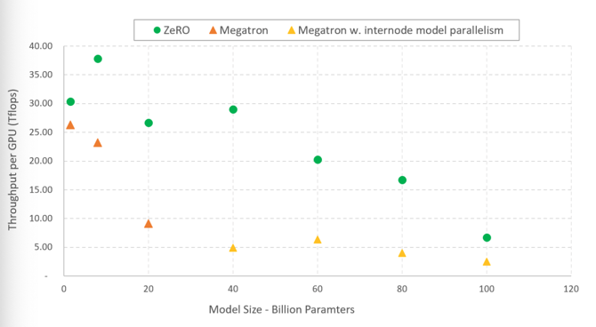
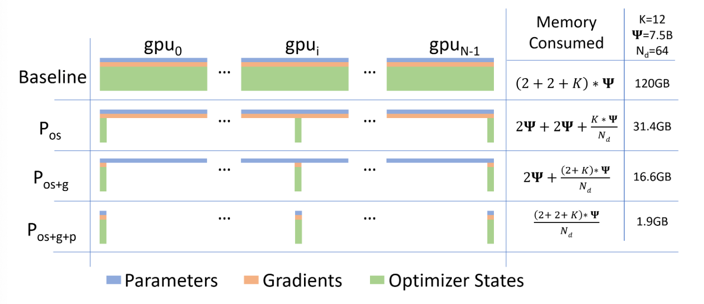
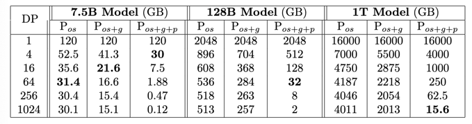
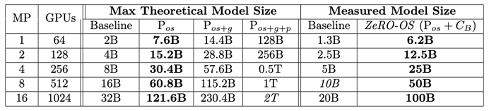
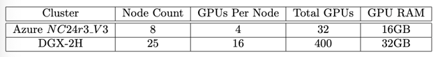
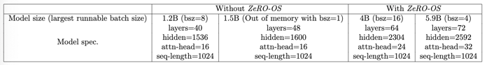
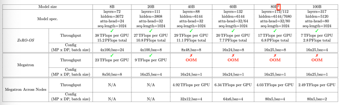
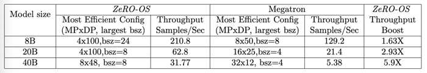
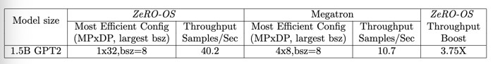
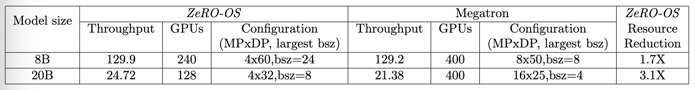

# ZeRO: Memory Optimization Towards TrainingA Trillion Parameter Models  
# ZeRO:对训练万亿参数模型的内存优化  

## 摘要    
 训练具有数十亿甚至数十亿兆个参数的大型DL模型具有挑战性，现有解决方案显示出根本的局限性，无法同时获得内存和扩展（计算/通信）效率。 
数据并行性无助于减少每个设备的内存占用：具有15亿个参数或更多参数的模型内存不足。 由于细粒度的计算和昂贵的通信，模型并行性很难有效地扩展到单个节点的多个设备之外。
        
 我们开发了一种新颖的解决方案，零冗余优化器（ZeRO），以优化内存，同时实现内存效率和缩放效率。 与在数据并行过程中复制内存状态的基本数据并行性不同，
ZeROpartitions会反过来对状态进行建模，以根据设备数量线性缩放模型大小。 此外，它通过计算和通信重新安排以及降低运行大型模型所需的模型并行度来保持缩放效率。 
我们对内存需求和通信量的分析表明：ZeRO可以使用当今的硬件（例如1024个GPU，64个DGX-2节点）扩展到超过1万亿个参数的潜力。
    
为了实现近期扩展目标并证明ZeRO的功能，我们实现了 ZeRO的第1阶段优化（总共描述了3个阶段）并测试了这个ZeRO-OS版本.ZeRO-OS与现有技术相比，
可减少内存并将模型大小增加4倍，最多可扩展到100B参数。 我们将致力于第二阶段优化的解锁，每台设备最多可节省8倍的内存，最终实现第三阶段优化，
相对于设备数量线性减少内存，并有可能扩展到任意大小的模型。 我们很高兴将非常庞大的模型从不可能训练转变为可行而有效的训练！

## 1  扩展介绍
背景与挑战深度学习（DL）模型正在变得越来越大，并且模型尺寸的增加可显着提高准确性。 在自然语言处理（NLP）领域，变压器为大型模型
（例如Bert-large（0.3B）[1]和GPT-2（1.5B）[2]）铺平了道路。 随着模型规模的不断增长，我们遇到了训练它们的挑战-它们不再适合单个设备（例如GPU或TPU）的内存，
并且仅添加更多设备将无助于扩展训练。

数据并行性和模型并行性是 两种跨设备并行训练的众所周知的方法。 数据并行性不会减少每台设备的模型内存占用量，
也无法解决训练大型模型时遇到的内存不足问题。为了训练大型模型，不适用于单个设备，因此出现了多种模型并行技术，该技术可将模型拆分为多个分区，并在设备之间并行执行分区。 
GPipe [3]和PipeDream [4]中的PipelineParallelism，以及Megatron [6]和MeshTensorflow [7]中的TensorSlicing [5]是模型并行性的两种众所周知的技术。 
例如，英伟达（Nvidia）最先进的模型并行实现的威震天（Megatron）展示了它们可以利用DGX2节点（由16个GPU组成）中的16路模型并行性扩展到多达20B个参数模型。 

在Megatron的示例中，尽管可以通过使用1万亿/ 200亿= 50个节点和800路模型并行性来轻松获得一个万亿参数模型，但计算粒度太细，通信量大以及节点间带宽有限 
只会扼杀性能并使系统无法使用（正如Megatron论文[6]所指出的）。更具体地说，DGX-2节点内部的对分带宽约为2.4 TB / s，而在两个DGX-2节点之间，对分带宽下降 
到微不足道的100 GB /秒。 由于带宽的下降，通过模型并行性将大型模型扩展到单个节点会导致性能下降。 我们使用威震天在各个节点上测试了40B参数模型，
并观察了约5T更快的V100 GPU（不到硬件峰值的5％），那么如何才能更有效地训练这些大型模型呢？ 

为了回答这个问题，我们首先在模型训练上分析现有系统的内存消耗。 我们发现，大部分内存被 i）优化器状态（例如Adam的动量和方差），ii）梯度和 iii）参数所占用，这些参数被称为模型的OGP状态（或简称为模型状态）。 
此外，我们观察到数据并行性具有良好的计算/通信效率，但内存效率低，而模型并行性具有较差的计算/通信效率。 更具体地说，数据并行性会在所有数据并行过程中复制整个模型状态，
从而导致冗余内存消耗;而模型并行性会对这些状态进行分区以获取高存储效率，但通常会导致计算粒度太细和通信成本高昂，从而降低了缩放效率。
这两种方法都静态地维持了整个训练过程中所需的所有模型状态，即使在训练过程中并非始终都需要所有模型状态。  

我们的解决方案我们开发了零冗余优化器ZeRO，以克服数据并行性和模型并行性的局限性，同时实现两者的优点。ZeRO通过在数据并行过程中划分OGP模型状态而不是复制它们，
从而消除了数据并行过程中的内存冗余。 通过在训练过程中使用动态通信计划来保留数据并行性的计算粒度和通信量，从而保持计算/通信效率。 我们称这种基于ZeRO的数据并行性。 
随着数据并行化程度的提高，它可以尽早减少模型设备的内存占用，同时保持通信量接近默认数据并行性。ZeRO支持的数据并行性可以适应任意大小的模型，只要有足够数量的设备即可 
共享模型状态，例如，我们的内存分析表明ZeRO可以在数据并行度为Nd = 1024的1024个GPU上拟合一个万亿参数模型（在5.5节中有更多详细信息）。  

由于Zero消除了数据并行性中的内存效率低下，很自然地提出以下要求： 我们还需要模型并行性吗？何时？ ZeRO如何与模型并行性一起工作？使用ZeRO，
模型并行性成为仅适合大型模型的吸引力较小的选择。ZeRO支持的数据并行性至少在减少每个设备的内存占用方面与模型并行性一样有效，
或者有时在模型并行性无法分割时更有效 模型均匀。 它还具有可比或更好的缩放效率。此外，数据并行非常容易使用，而且广泛适用于不同的工作负载，
而现在的模型并行方法常常需要模型开发人员做一些工作来修改他们的模型，系统开发人员需要做一些工作来设计分布式操作符，
而现有的工作(如emegatron)只支持有限的操作符和模型集。也就是说，在某些情况下，我们仍然希望利用模型并行性:当仅使用dataparallelism进行聚合的批大小太大
而无法实现良好的收敛时。在这种情况下，可以结合模型并行性，使模型具有可接受的聚合批处理大小。

我们表明，ZeRO可以与任何模型并行方法结合使用，这可以导致每个设备在数据并行度为Nd且模型并行度为Nm的情况下最大理论内存减少Nd×Nm次。 
这可以使我们将atrillion参数模型适合于具有16路模型并行性（在每个DGX2node中）和64路数据跨节点并行性的1024个GPU上，并有效地运行它。

实施和评估ZeRO具有三个主要的优化阶段：分区（1）优化器状态，​​（2）梯度和（3）参数，与仅使用数据并行性或将数据组合使用相比，
ADAM这样的流行训练优化器分别节省了4，8和Ndtimes的内存 数据和模型并行性。 例如，最新数据+模型并行实现Megatron在DGX-2节点集群上支持约20B参数模型训练，
而这三个优化阶段将能够训练80B，160B和任意模型大小（Nd× 20B）。

作为评估的第一步，我们在PyTorch之上实现了优化器状态分区（阶段1，Pos），并将其称为versionZeRO-OS。 我们展示了其支持80-100B参数模型的能力，
我们希望该模型能够解决模型尺寸的近期增长。ZeRO-OS的实验结果表明：
- 在没有任何模型并行性的情况下，ZeRO-OS支持的数据并行性可以训练模型 -els在V100 GPU（具有32GB的设备内存）上具有高达6B的参数，
而现有系统（例如PyTorch Distributed Data Parallel）在1.5B参数模型中的内存不足。ZeRO-OS提供4倍的内存节省/模型尺寸提升。 
模型开发人员可以运行多达6B参数模型，而无需担心模型并行性。
- 与模型并行性相结合，ZeRO-OS可以高效地运行80B参数模型，而仅使用威震天这样的现有系统就无法有效地扩展到20B参数以上，如图1所示。 
ZeRO-OS还适合100B参数模型，而无需节点间模型并行性。
- ZeRO-OS所提高的内存效率还有助于更高效地运行模型（例如，通过允许较小的模型并行度和更大的批处理大小）：
我们证明GPT-的吞吐量提高了6倍 例如大小在1.5B到100B之间的各种型号。 
 
我们将共享ZeRO-OSsoon的代码存储库。 随着时间的流逝，我们将在剩余的两个阶段释放ZeRO的完整实现，以支持具有数万亿参数的训练模型。 
借助ZeRO，我们的目标是将大型模型从不可行培训转变为可行高效培训。

## 2 背景    
DL training迭代地按步骤处理数据样本，每一步都包含前向传播、后向传播和权值更新。

*图1:与威震天相比，zero - oson的可运行模型大小和吞吐量。所有的实验都使用尽可能小的模型并行度进行。对于zero - os，模型并行度始终适合单个节点，
而对于Megatron，大于20B的模型需要跨节点的模型并行度。关于实验设置和配置的更多细节见第9节。*

为了跨gpu扩展DL训练，由于跨步骤的顺序依赖性，每个步骤必须并行化。数据并行和模型并行是跨多个gpu实现DL训练步骤的两种最主要的方式。

### 2.1 数据并行性(Data parallelism, DP)
DP是一种适用于GPU内存的训练模型，用于将训练扩展到多个GPU。在数据并行性中，模型参数在初始化期间复制到每个GPUprocess上。
在每个步骤中，在所有数据并行进程中平均分配一个小批处理，以便每个进程在不同的数据样本子集上执行正向和反向传播.

在反向传播结束时，使用all-reduce通信集合对所有进程的梯度进行平均，从而在每个数据并行进程中创建平均梯度的副本。
然后，每个进程使用平均梯度来计算并将权重更新应用于其模型参数副本。请注意，在数据并行性中，OGP状态(权重参数、平均梯度和优化器状态)被复制到所有数据并行进程中，
从而产生巨大的不确定性.

### 2.2模型并行训练
虽然模型并行性（MP）可以用于其他目的，例如减少聚合批处理大小，但它主要用于减少每个GPU的内存占用量.

模型并行性将模型划分为多个分区，并在设备之间执行相应的前向和后向计算，即，每个输入数据样本的计算被划分并在多个设备上执行。
模型并行性可以通过两种方式工作：i）通过垂直分区[3，4]，以及 ii）通过水平分区[5，6]。 垂直分区通过在多个GPU之间划分DL模型中的总层来拆分模型，
并使用流水线微批处理来避免GPU停顿。 另一方面，水平分区通过并行化诸如矩阵乘法或按元素操作之类的基础计算，在多个GPU上拆分单个DL层.

尽管这些技术在训练吞吐量和批量大小方面都有其优缺点 ，两者在内存消耗方面的潜在影响是相同的。两者均通过在多个GPU之间划分激活，模型参数，
梯度和优化器状态来减少每个GPU的内存占用量.

## 3 所有的内存都到哪里去了?  
我们后退一步来检查当前训练系统的内存消耗，并进行了一些观察。例如，一个1.5B的参数GPT-2模型的权值(或参数)在16位训练中占用了3GB的内存，但是，
它不能使用Tensorflow或Pytorch在一个32GB内存的singleGPU上进行训练。人们可能想知道所有的记忆都到哪里去了。

在模型训练过程中，大部分内存被以下三种状态之一消耗:i)激活，ii)OGP状态，即，由优化器状态、参数梯度和参数本身组成的张量，以及iii)临时缓冲区。
有可能以33%的重新计算开销[9]为代价，将激活所需的所有内存提前清除。像威震天这样的框架已经实现了这种重新计算。在这里，我们来看看后两者所消耗的内存。

### 3.1优化状态、梯度和参数
启用重计算后，大部分GPU内存在训练过程中被OGP张量消耗。以ADAM为例，他是DL培训最流行的优化器之一。ADAM需要存储两个优化器状态，
i)时间平均动量和ii)梯度的变化来计算更新。因此，要用ADAM训练一个模型，必须有足够的内存来保存梯度的动量和方差的副本。此外，需要有足够的内存来存储梯度和权重本身。
在这三种与参数相关的张量中，优化器状态通常消耗最多的内存，特别是在应用混合精度训练时。

混合精度训练最先进的方法是通过混合精度（fp16 / 32）训练在当前一代的NVIDIA GPU上训练大型模型，其中参数和激活存储为fp16，从而可以在其上使用高吞吐量张量核心单元 GPU。 
在混合精度训练期间，使用fp16权重和激活来执行正向和反向传播。 但是，为了在向后传播结束时有效地计算和应用更新，混合精度优化器保留了参数的fp32复制以及所有其他优化器
状态的fp32复制。

让我们以亚当为具体的例子。混合模型的精度训练Ψparameters用亚当需要足够的内存来保存曾帮工p16的副本参数和梯度,与2Ψ和2Ψ字节的内存需求。
此外,它深埋的优化器:曾帮工的第9 -副本参数,动量和方差,withmemory 4Ψ,要求4Ψ,分别和4Ψ字节。让我们用K表示优化器状态的乘数内存，即，存储它们所需的额外内存为K个字节。 
混合精度ADAM的K =12。这总共导致2 in +2Ψ+KΨ=16Ψ的内存需求。 对于具有15亿个参数的模型（例如GPT-2），这将导致至少24GB的内存需求，
这远远高于仅保存f p16参数所需的微薄3GB内存。

### 3.2临时缓冲区
对于大型模型，用于存储中间结果的临时缓冲区会消耗大量的内存。 诸如梯度全归约或梯度范数计算之类的操作倾向于在应用该操作以提高吞吐量之前将所有梯度融合到一个平坦的缓冲区中。 
例如，随着消息大小的增加，GPU的全减少带宽得以提高。 虽然梯度本身通常存储为fp16张量，但根据操作，融合缓冲区可以是fp32张量。 当模型的大小很大时，这些临时缓冲区的大小就不那么重要了。 
例如，对于具有1.5B参数的GPT-2模型，平坦的fp32缓冲区将需要6GB的内存。

## 4 ZeRO：深入了解和概述
现在我们知道所有内存的去向，如何在不牺牲效率的情况下减少内存占用？ 请注意，效率是这里的关键：没有此约束，简单的解决方案
（例如将所有参数状态移至CPU内存或无限期增加模型并行度）可以减少内存占用量。

我们在不牺牲效率的情况下减少内存占用的解决方案基于以下三个关键见解：
- 数据并行化比模型并行化具有更好的扩展效率，因为模型并行化减少了计算的粒度，同时还增加了通信开销。 
超过某一点，较低的计算粒度会降低每个GPU的效率，而增加的通信开销却会掩盖整个GPU的可伸缩性，尤其是在跨越节点边界时。 
相反，数据并行性具有更高的计算粒度和较低的通信量，从而具有更高的效率。
- 由于模型状态在所有数据并行过程中都是冗余存储的，因此数据并行性在存储效率方面非常低。 相反，模型并行性对模型状态进行分区以获得内存效率。
- 数据和模型并行性都保留了整个训练过程所需的所有模型状态，但并非始终都需要所有状态。 例如，仅在层的正向传播和反向传播期间才需要与每个层相对应的参数。

基于这些见解，我们开发了零冗余优化程序ZeRO-克服了数据和模型并行性仍然保留其优点的局限性。ZeRO通过对OGP模型状态进行分区而不是复制来消除数据并行过程中的内存冗余（第5节）， 
它通过在训练过程中动态，智能地移动模型状态来保留计算/通信效率（第6节）。 通过这样做，ZeRO最终为数据并行性提供了动力，
从而随着数据并行性程度的提高而线性地减少了模型的每个设备的内存占用，同时保持通信量接近默认数据并行性。

  
*图2：在启用各种ZeRO内存优化的情况下，比较每个设备的参数，梯度和优化器状态的内存消耗。 在存储器消耗公式中，Ψ表示模型大小（参数数），K表示优化器状态的存储器乘数，
Nd表示数据并行度。 在此示例中，我们基于Adam优化器的混合精度训练，假设模型化为Ψ= 7.5B，数据并行度为Nd = 64，K = 12。*

ZeRO增强了数据并行性，以减少内存消耗并提高可运行模型的大小。 此外，它可以与任何模型并行方法并行使用。 当培训工作同时使用模型并行性和基于ZeRO的数据并行性时，
其内存节省（每个设备）是模型并行性与Zero节省的结果（第7节）。

## 5 ZeRO：内存优化
虽然现有的数据并行方法在每个设备上复制OGP模型状态并引入了显着的内存开销，但是ZeeRO通过在数据并行过程中对它们（优化器状态，​​渐变和参数）
进行分区来消除这种内存冗余。图2进行了量化和可视化 有和没有ZeRO时的内存需求。 对于具有Ψ个参数且数据并行性为Nd的模型，该图显示了分别消除
（1）优化器状态，​​（2）梯度和（3）参数冗余之后的内存占用量。我们将它们称为ZeRO：Pos的三个技术或优化阶段 ，Pg和Pp，我们将在5.1、5.2和5.3节中详细介绍。 
此外，ZeRO使用性能高效的恒定大小缓冲区（第5.4节）按模型大小成比例地删除大型缓冲区，以解决大型临时缓冲区的内存开销。 内存优化需要仔细的计算，
重新安排通信时间以及跨数据并行过程进行映射。 接下来，我们将对这些技术进行详细介绍。

### 5.1 Pos：优化器状态分区
对于Nd的数据并行度，我们将优化器状态分组为N个不相等的分区，以使该数据并行进程仅更新与该分区对应的优化器状态。 因此，每个数据并行进程仅需要存储和更新
totaloptimizer状态的1Nd。请注意，这里我们仅消除了优化器状态冗余，而不是参数冗余。 由于每个进程仅具有整体优化器状态的1Ndof，因此只能更新参数的1Ndof。 
在每个训练步骤的最后，我们将跨数据并行过程执行一次全收集，以获取跨所有数据并行过程的完全更新的参数。 我们将这种优化称为Pos。内存节省：
如图1所示，优化状态分区后的内存消耗从4 + K +减少到4 + K + Nd。 如图2所示的具体示例，一个7.5 B参数模型使用具有64路数据并行性（Nd = 64）
的Pos需要31.4 GB的内存，而需要120 GB的标准数据并行性。 此外，当N变大时，内存需求从4个+ 12个= 16个字节减少到4个+12个Nd≈4个字节，导致内存减少4倍。

### 5.2 Pg：梯度划分
由于每个数据并行过程仅更新其对应的参数分区，因此仅需要减小对应参数的梯度即可。 因此，随着每个层的每个梯度在反向传播期间变得可用，
我们仅在负责更新相应参数的数据并行过程中减少它们。 减少后，我们不再需要渐变，可以释放它们的内存。 这样可以将保持梯度从2个字节减少到2个Nd所需的存储空间。
有效地，这是一个减少分散操作，其中将与不同参数对应的梯度减少到不同的过程。 

为了在实践中提高效率，我们使用了一种存储桶化策略，在其中对与特定分区相对应的所有梯度进行存储桶化，然后一次对整个存储桶进行约化。 
这在本质上类似于NVIDIA AMP [10]优化器将全缩减梯度计算存储为重叠通信和计算的方式。 但是，在这种情况下，我们在适当的分区边界执行缩减而不是全缩减，
以减少内存占用，此外还进行了重叠的计算和通信。 我们将这种优化称为Pg。

内存节省：通过消除梯度和优化器状态冗余，我们将内存占用空间进一步减小至2x +14ΨNd≈2Ψ。 作为图1所示的具体示例，
一个7.5 B参数模型使用具有64路数据并行性（Nd = 64）的Pos + g仅需要16.6 GB的内存，而需要120 GB的标准数据并行性。 
当Ndis大时，内存需求从2个+ 14个= 16个字节减少到2个+14个Nd≈2个字节，导致内存减少8倍。

### 5.3 Pp：参数分区
与优化器状态和梯度一样，每个过程仅存储与其分区对应的参数。 当需要向前或向后传播其分区之外的参数时，它们将通过广播从适当的数据并行处理中接收。 
尽管乍看之下似乎会招致大量通信开销，但我们表明，这种方法只会将基准数据并行系统的总通信量增加到1.5倍，同时使内存减少与Nd成正比。

  
*表1：作为数据并行性（DP）函数的ZeRO中不同优化的每设备内存消耗的分析结果。 粗体突出显示的是最小数据并行度和ZeRO优化的组合，该模型可以适合32GB V100 GPU的群集。*

节省内存：通过参数分区，我们可以将一个参数模型的内存消耗从16减少到16 Nd。 如图1所示的具体示例，一个7.5B参数模型使用Pos + p + g具有64路数据并行性（Nd = 64）时需要1.9 GB的内存，
而需要120 GB的标准数据并行性。 这具有深远的意义：只要具有足够数量的设备可以共享模型状态，ZeROpower数据并行性就可以适应具有任意大小的模型。

### 5.4 CB：恒定大小的缓冲区
除分区外，ZeRO还对管理时间数据的缓冲区执行另一种优化。 在训练期间，某些操作的计算效率可能高度依赖于输入大小，而较大的输入会实现更高的效率。 
例如，大型的全减少操作所获得的带宽比较小的操作要高得多。 因此，为了获得更高的效率，在执行这些操作之前，诸如NVIDIA Apex或Megatron之类的高性能库会将
所有参数融合到单个缓冲区中。 但是，融合缓冲区的内存开销与模型大小成正比，并且可能会受到抑制。 例如，对于3B参数模型，一个32位融合缓冲区将需要12 GB的内存。 
为了解决这个问题，当模型变得太大时，我们仅使用性能高效的恒定大小的融合缓冲区。 这样，缓冲区大小不依赖于模型大小，并且通过将缓冲区大小保持足够大，
我们仍然可以实现良好的效率。

### 5.5 内存优化总结
现在，我们完成了ZeRO内存优化的讨论。 划分Pos，Pos + g和Pos + g +的三个阶段分别使模型状态下每个数据并行进程的内存消耗分别减少4倍，8倍和Nd。
 型号大小。 表1给出了更多关于内存影响分析的示例，这些示例针对变化的数据并行度启用了3个阶段的分区优化。 如果没有ZeRO，则无论数据并行度如何，
 内存消耗都等于表中的第一行。 请注意，在Nd = 64的情况下，ZeROcan可以分别使用Pos，Pos + g和Pos + g + p训练具有7.5B，14B和128B参数的模型。 
 当Nd = 1024时，启用所有优化功能（Pos + g + p）的ZeRO可以训练1Trillionparameters的模型！ 或可能具有任意大小的模型！ 没有ZeRO，
 仅最大的模型数据并行性就可以运行少于15亿个参数。
 
## 6 ZeRO：通讯分析
ZeRO通过消除内存冗余来提升模型的大小，自然而然地要问我们是否在交换通讯量以提高内存效率。 
换句话说，与基准数据并行方法相比，ZeRO驱动的数据并行方法的通信量是多少？
答案分为两部分:  
> i）ZeRO不会使用PosandPg进行额外的通信，同时最多可减少8倍的内存，从而使总 当使用PosandPg上的Ppin时，内存占用空间为2x + 14xNd.  
> ii）ZeRO最多可产生1.5倍的通信，同时进一步将存储空间减少Nd倍，从而使总的内存占用面积达到16xNd.  

在这里，我们提出了证明这些结果的分析。 首先，我们简要介绍标准数据并行训练的通信量.

### 6.1数据并行
通信量在数据并行训练期间，在计算下一步更新之前，在反向传播结束时对所有数据并行过程的梯度进行平均。 使用全缩减通信集合来执行平均。 
对于大型模型，全缩减通信完全受限于通信带宽，因此，我们的分析仅限于往返于每个数据并行过程的总通信量。

全缩减的最新实现使用两个分步方法，第一步是减少分散操作，可减少不同过程中数据的不同部分。 接下来的步骤是一个全聚集操作，其中每个进程都在所有进程上收集简化的数据。 

这两个步骤的结果是全部归约。使用流水线方法实现了减少分散和全部聚拢，这导致每个归约化元素的总数据移动为data个元素（对于具有Ψ个元素的数据）分散的步骤。 
因此，我们的标准数据并行方法在每个训练步骤中都会产生2的数据移动。

### 6.2 ZeRO通信量
Pos+g的通信量：使用梯度分区时，每个进程仅存储梯度的一部分，这是更新其相应参数分区所必需的。因此，ZeRO不需要全减少，而只需要对散点减少操作即可 梯度。
如上所述，此操作的通信量为1/3。 在每个进程更新其负责的参数的分区之后，将执行全收集以从所有数据并行进程中收集所有更新的参数。 如上所述，这导致通信量为1/3。 
因此，每个训练步骤的总通信量为Ψ+Ψ=2Ψ，与基线数据并行方法完全相同。

Pos+g+p的通信量：参数分区后，每个数据并行处理仅存储其更新的参数 。 因此，在正向传播期间，它需要接收所有其他分区的参数。 但是，可以对此进行流水线处理以避免内存开销。
在模型的对应于特定分区的部分上计算前向传播之前，负责该分区的数据并行进程可以将权重广播到所有数据并行进程。 一旦完成该分区的前向传播，就可以丢弃参数。 
因此，总通信量为××NdNd ＝ 2/3。 换句话说，我们通过在整个前向传播中扩展参数来重新计划所有参数，并在使用完参数后将其丢弃。 但是请注意，对于反向传播，
需要再次发生这种全部聚集（以相反的顺序）。
  
  
*表2：通过内存分析确定的最大模型大小的上限（左）和使用ZeRO-OS运行时测得的模型大小（右）。 ZeRO-OSwell的结果与Pos的结果一致，
表明我们的内存分析为模型内存需求提供了现实的上限。 请参阅第9.4节中的更多讨论.*

因此，总通信量是这些全聚集所引起的通信量的总和，而不是由于梯度的减少散射所引起的通信量的总和。 因此，总体积为3Ψ，是基线的1.5倍。 
梯度和参数分区都利用了这样的见解-并非一直都需要梯度和参数的所有状态-通过明智地交流状态来优化内存。

### 6.3通信延迟这里我们要指出的是，尽管我们的优化会影响通信延迟，但其对整体性能的影响可能很小。 请注意，
Ppimplements将reduce-scatter作为一系列reduce操作的序列，而Ppimplements则作为一系列广播操作的序列。 此外，Cb可以将大型通信集合划分为多个较小的通信集合，
以避免内存开销。 显然，这些顺序操作会增加通信延迟。 但是，对于具有数千亿参数的大型模型，即使具有足够大的恒定缓冲区大小CB，消息大小也足够大，
因此通信时间受通信量和通信带宽的限制，而不是受延迟的限制。

## 7 ZeRO＆Model Parallelism
ZeRO解决了数据并行性的内存效率低下的问题，人们可能会怀疑：是否仍需要模型并行性？何时？ ZeRO是否具有模型并行性以及如何工作？

通过ZeRO，模型并行性变得不再那么重要/有吸引力，其唯一目的是减少内存占用并适合大型模型.ZeRO支持的数据并行（Pos + g + p）至少在减少每个设备方面同样有效 
内存占用作为模型并行性，有时在模型并行性无法平均划分模型时可能会更有效。 它还具有可比或更好的缩放效率。 此外，数据并行性非常易于使用，并且广泛适用于不同的工作负载，
而当今的模型并行性方法通常需要模型开发人员进行一些工作来修改其模型，系统开发人员需要制定分布式运算符，而像Megatron这样的现有工作仅支持有限的运算符和模型。

话虽这么说，在某些情况下模型并行性还是有帮助的：当仅使用数据并行性的合计批处理规模太大而无法实现良好的收敛性时.这时，可以将模型并行性与ZeRO支持的数据并行性结合使用，
以使模型具有可接受的汇总批处理大小。

ZeRO（orZeRO支持的数据并行性）可以与任何形式的模型同位相结合以训练非常大的模型。 可以将总内存节省计算为模型并行性与ZeRO节省因子的乘积。
更具体地说，如果N的模型并行性将每个设备的模型大小从Ψ减少到Y，其中Y =Ψ/ Nm，则每个设备的总内存消耗为1Nm×（4Ψ+12ΨNd），1Nm×（2Ψ+14ΨNd）和16ΨNd×Nm，
使用Pos，Pos + gandPos + g + p。 作为一个具体示例，具有16路模型并行性和64路数据并行性的32 B参数将分别消耗8.4GB，4.4GB和0.5GB，
而使用Pos，Pos + gandPos + g +则分别消耗，而如果不使用ZeRO，它将消耗至少32GB 通过节省大量内存.
 
ZeRO与模型并行性相结合使当前的硬件能够以相同的模型并行度高效运行较大的模型，而无需跨越节点边界。 表2显示了可以在给定的模型并行度和数据并行度下运行的最大模型的上限。 
在表中，基线列表示使用数据和模型并行性的现有方法。 请注意，在理论上（没有任何激活和其他内存开销）使用16向模型并行性时，基线最多可以运行32B参数模型，
而启用各种内存优化的ZeRO可以容纳1210亿，2300亿和2万亿 分别使用Pos，Pos+g，Pos+g+p.

## 8 迈向1万亿个参数的步骤
当今发布的最大模型约为1B至10B参数，这些参数已经难以接受训练。 迈向2万亿个数量级的万亿规模之路，将充满障碍，惊喜和创新。 
尽管我们并不声称了解或解决所有这些问题，但ZeRO还是从系统角度解决了最基本的挑战之一：在当前的硬件上使这种规模的模型适合您的能力，
同时使其能够以良好的系统可扩展性进行训练。 

最先进的框架Megatron可以训练的最大模型，其吞吐量可以接受，这是DGX-2H系统中的16-20B参数模型。通过在多个DGX节点之间具有模型并行性进一步扩展可显着提高效率。

相对于有效运行的模型大小，ZeRO大大提高了系统功能。 它使当前的硬件可以运行更大的模型，而无需细粒度的模型并行性来跨越节点边界。 
如表1所示，在启用所有优化功能（Pos + g + p）的情况下，仅使用数据并行性，ZeRO可以在1024个GPU上容纳超过1万亿个参数。 
或者，当与模型并行性结合时（如表2所示），ZeRO可以在具有16路模型并行度（在每个DGX2节点内）和64路数据并行度的1024个GPU上安装超过1Trillion参数。 
有效地运行具有一万亿个参数的模型不再是不可能！

计算能力差距在可接受的时间范围内端到端训练一个万亿参数的模型，然而，仍然需要大量的计算能力，而这是当今AI集群所缺乏的。

为了了解资源需求，我们与Bert-Large进行了简要比较 可以在67分钟内在1024 GPU DGX-2H群集上训练.Bert-Large [11]。 
1 TrillionParameter模型可以轻松地比数据样本的Bert-Large模型包含3000倍（1万亿美元/ 3.3亿）的计算量。 即使我们假设序列长度相同，
假设相同的硬件和相似的计算效率来训练模型，训练1T模型所需的样本总数将需要140天。 实际上，数据样本和序列长度都可能随着模型大小的增加而增加。 
需要一个触发器系统来在合理的时间内训练1T参数模型。 但是，当这种计算能力可用时，我们希望ZeRO提供系统技术以有效地运行1T模型。

  
*表3：用于评估ZeRO-OS的硬件环境*

## 9 ZeRO-OS的实现和评估
虽然1T参数模型需要万用表超级计算机，但可以在已经存在的1024 GPU系统上在几周内训练80B-100B参数模型（再次假设相同的序列长度和数据大小以及相似的计算效率 ）。 
因此，对于评估的第一步，我们实施了优化程序状态分区（Pos），并展示了其支持此类模型的能力，这有望解决模型规模的近期增长。 我们称此为Zero-OS。
ZeRO的全面实施及其对万亿参数的支持将在稍后发布。
 
### 9.1 ZeRO-OS的实现
我们将PyTorch的ZeRO-OS实施为割炬优化器的包装类。 要使用ZeRO-OS，火炬用户可以简单地将自己喜欢的优化器换成同一优化器的Zerowrapped版本，只需要更改几行代码即可。

ZeRO-OS实现Pos以消除了优化器状态冗余，而CB减少了全部减少的缓冲区大小。 Pos能要求的全部聚集可以作为全部聚集或一系列广播操作来执行。
前者对延迟的影响较小，但后者具有较少的内存开销（使用较小的缓冲区）。

与基线数据并行相比，ZeRO-OS的通信量为1.5倍，因为我们目前使用的是全减少而不是减少分散。 通过切换到减少散射来消除附加通信很简单。 
我们观察到每台设备的批量大小适中时（例如16个），这1.5倍的通信量并不是真正的瓶颈。 当我们启用所有优化Pos+g+p，它还可以达到模拟通信量的目的。

### 9.2评估方法
在介绍我们对ZeRO-OS进行评估的实验结果之前，我们先给出一些实验设置的详细信息。硬件我们在两种不同的硬件环境中进行了实验。 
第一个环境是由25个DGX-2节点组成的群集，总共有400个GPU。 第二个环境是由8个AzureN C24r3V3节点组成的Azure群集，每个节点包含4个V100 GPU，总共32个GPU。 
表3总结了我们的硬件环境的详细信息。
  
*表4：仅使用数据并行性对大型模型进行Zero-OSenables训练 该测试是在32个V100 GPU（2个DGX2盒）上完成的。*

基准模型并行性我们使用NVIDIA的Megatron作为基准并行模型实验的基准，因为据我们所知，它是最新技术。 

威震天的最新结果报告称，可以使用32个DGX-2H节点（总共512个Tesla SXM3 32GB V100 GPU）扩展多达20B个参数模型。

### 9.3单独使用数据并行扩展到6B参数
在本研究中，我们研究ZeRO-OS如何增加仅使用数据并行即可进行训练的模型的大小。 对于由于软件（例如，复杂的模型结构）和/或硬件（不良的互连带宽）
环境的限制而不能有效使用模型并行性的用户而言，该功能是有益的。 对于此类用户，ZeRO-OS可以将其扩展到比现有数据并行性（例如PyTorch的DDP）可以实现的更大的模型。 
具体来说，我们评估了使用2个DGX-2H节点，总共32个GPU和每个GPU 32GB RAM可以在有无ZeRO-OS的情况下进行训练的最大模型。 
该实验的结果显示在表中：4.结果表明，如果没有ZeRO-OS，仅使用数据并行性就只能训练小于1.5B的模型。 相比之下，使用ZeRO-OS，
最多可以使用批处理大小为4的6B参数模型进行训练，而仅使用数据并行即可。 总的来说，ZeRO-OS支持数据并行性以训练比使用现有技术可能的模型大4倍的模型。

### 9.4缩放到80B-100B参数
在这项研究中，我们研究了Zero-OS可以有效训练的最大模型尺寸，这里我们使用Megatron将Zero支持的数据并行性与模型并行性相结合。 
我们还比较了单独使用威震天的ZeRO-OS的结果。 这项研究的结果如图1所示.ZeRO-OS有效地运行80B参数模型，而像Megatron这样的现有系统无法有效地扩展到20B参数以上.
ZeRO-OS也适合100B参数模型而无需低效率的节点间模型并行性。 对于相同大小的模型，ZeRO-OS的吞吐量更高。
  
*表5：在V100 GPU / DGX2节点上使用ZeRO-OSvs Megatronalone运行参数为8B至100B的类似GPT的模型。 GPU的数量等于模型与数据并行性的乘积（实验中介于384至400个GPU之间）。 
威震天在运行大于20B模型参数且模型并行度为16（在单个DGX-2节点内）的情况下会用尽内存，如中间行所示。 可以使用威震天使用节点间模型并行性来运行较大的模型，
但是性能会大大降低，太低而无法在实践中使用，如表的最后一行所示.*

表5提供了这些实验的更多详细信息，包括不同实体模型的配置以及相应的模型并行配置。 在这里，我们可以看到，对于给定的模型大小，
ZeRO-OS能够使用较低的模型并行度和较高的批处理大小来拟合模型，这说明了吞吐量的提高。
  
*表6：ZeRO-OS在V100 GPU / DGX2节点上对十亿个参数模型的吞吐量改进。 GPU的数量等于模型和数据并行性的乘积（实验中介于384-400个GPU之间）*

可以进一步提高100B参数运行上的ZeRO-OS吞吐量。 例如，使用更多的GPU将减少每个GPU的内存占用量，从而允许更大的批处理大小和每个GPU和总吞吐量更高。 
我们还在努力进行更多优化，以进一步减少内存消耗，以适应更大的批量. 

在Megatron上，ZeRO-OS的另一个好处是可以在模型架构空间中支持更广泛的配置。 例如，威震天要求隐藏的尺寸和注意头可以通过模型并行度来整除。 
当我们将模型并行度提高到较大的值（例如64和80）时，这些约束变得更加严格。从这个角度来看，ZeROenables运行具有较小模型并行度的大型模型会在我们
可以训练的体系结构中提供灵活性。 例如，ZeRO-OScan火车80B模型的模型平行度为16，因此注意头为16和32（16的倍数），而Mega-tron要求模型的平行度为80，
因此注意头至少为80，并且隐藏维度为 80的倍数。此外，我们测量的最大可训练模型与我们的分析接近，如表2所示，表明分析和实施的合理性。 之所以存在较小的差距，
是因为我们对最大可训练模型大小的上限分析未计算缓冲区和激活的主题消耗，而这些消耗可能是实现和特定于模型的。

此外，我们测得的最大可训练模型与我们的分析接近，如表2所示，表明分析和实施的合理性。 之所以存在较小的差距，是因为我们对最大可训练模型大小的上限分析
未计算缓冲区和激活的主题消耗，而这些消耗可能是实现和特定于模型的。

  
*表7：通过ZeRO-OS实现的GPT2吞吐量提高。 该测试在32个V100 AzureGPU上运行（16GB内存，每个节点4个GPU，PCIe，40Gbps IB）*

  
*表8：ZeRO-OS降低了实现相同系统吞吐量所需的资源。*

### 9.5最多提高6倍的系统吞吐量
在本研究中，我们评估Zero-OS如何提高系统吞吐量。 在DGX-2集群上，如表6所示，ZeRO-OS通过在400个GPU上运行的8B参数模型的1.63倍，
在20B参数模型上的2.9X和在384个GPU上的40B的性能提高了将近6倍，从而使威震天的系统吞吐量得以提高。 在Azure群集上，如表7所示，对于1.5B参数GPT2模型，
ZeRO-OS与单独的Megatron相比，吞吐量提高了3.75倍。 如前所述，这些吞吐量的提高来自以下事实：ZeRO-OS能够使用较低的模型并行度和较大的批处理量来适应这些模型。

### 9.6最多可节省3倍的资源节省
在本研究中，我们评估了ZeeRO-OS吞吐量提高所带来的资源节省。 特别是，我们希望找出ZeRO-OS达到与DGX-2群集上的威震天类似的吞吐量所需的GPU数量要少得多。 
结果总结在表8中。结果表明，ZeRO-OS可以节省资源（对于8B参数模型为1.7倍，对于20B参数模型为3.1倍）。 这些结果表明，ZeRO-OS可能有益于大大减少训练大型模型的成本。

## 10结束
语我们看到ZeRO的内存优化有望用于训练具有数千亿甚至数万亿个参数的大型模型。 我们在ZeRO-OS中实现的只是功能的有限子集，与现有系统相比，
这已经证明了模型大小和训练效率的显着提高，并实现了100B参数训练。 我们将尽快共享我们的代码存储库，但是请您早日了解它，我们希望得到社区的反馈和帮助，
共同发挥ZeRO的全部力量，并训练目前无法训练的DL模型！

